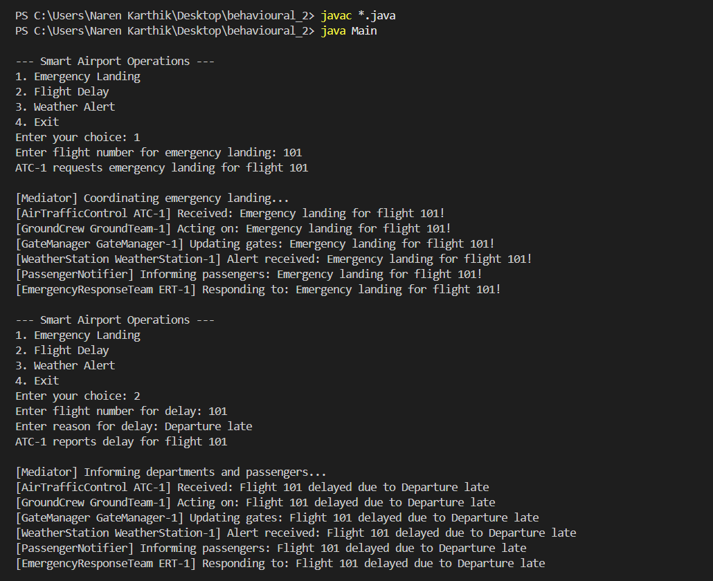
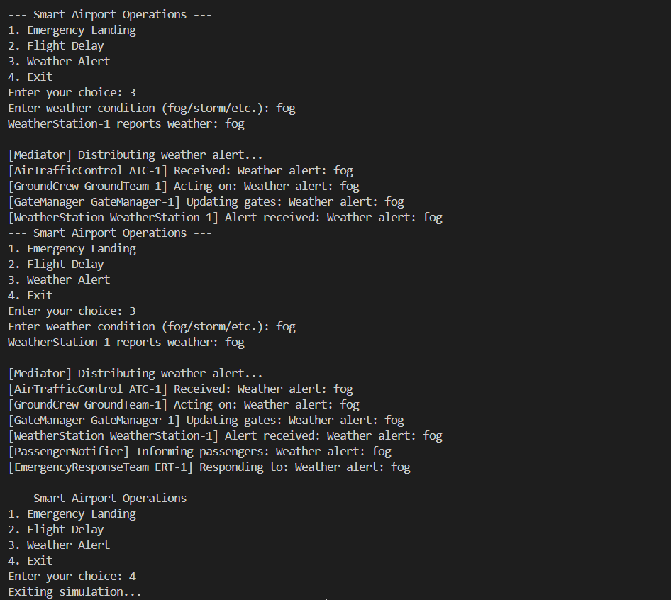

# Smart Airport Operations Management - Mediator Pattern

## Project Overview

This project demonstrates the **Mediator Design Pattern** through a **Smart Airport Operations Management System**.  

The system centralizes communication between multiple departments in an airport, such as **Air Traffic Control, Ground Crew, Gate Manager, Weather Station, Passenger Notifier, and Emergency Response Team**, allowing them to operate without direct dependencies on each other.  

All operations are coordinated by a **Mediator** called `AirportOperationsCenter`.

---

## Features

- **Emergency Handling:** Manage emergency landings with coordinated response from all departments.
- **Flight Delays:** Notify departments and passengers when a flight is delayed.
- **Weather Alerts:** Weather changes trigger actions in all relevant departments.
- **Real-Time Coordination:** Mediator ensures smooth operations without direct communication between departments.
- **Scalable Design:** New departments or devices can be added easily.
- **Interactive Console Input:** Users can simulate different scenarios in real-time.

---

## How to Run

1. Open the **Integrated Terminal** in your editor (or command prompt) and navigate to the project folder:
    - cd path\to\Exercise1-Use_Cases\Behavioural_Pattern\Mediator_Smart_Airport
2. Compile all Java files:
    - javac *.java
3. Run the application:
    - java Main

---

## Why This Is Creative

- **Complex Orchestration:** Multiple departments respond seamlessly to events.  
- **No Direct Dependencies:** Each department communicates only via the mediator.  
- **Real-Time Adaptation:** System responds instantly to emergencies, delays, and weather events.  
- **Scalable:** Easily add new departments or devices (VIP flights, cargo teams, drones).  

---

## Console Screenshots

 

