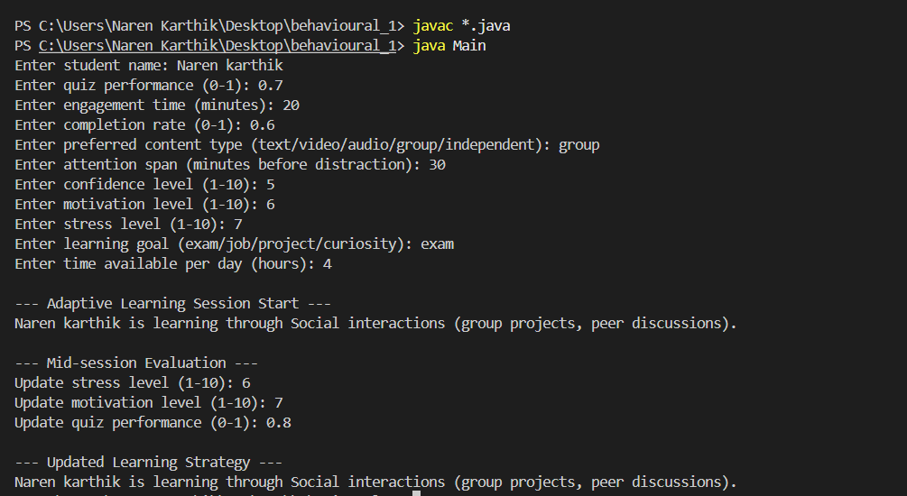

# Strategy Pattern – Adaptive Learning Platform

## Overview
This project demonstrates the **Strategy Behavioral Design Pattern** using an **Adaptive Learning Platform**.  
The system dynamically adapts teaching methods (strategies) based on the learner’s behavior, performance, and preferences.  

Instead of hardcoding learning logic, the platform encapsulates different learning styles as independent strategies that can be swapped at runtime.

---

## Components

### **Context**
- `StudentLearningSession`  
  Maintains a reference to the current learning strategy and allows switching dynamically.

### **Strategies**
- `VisualLearningStrategy` → Diagrams, videos, infographics  
- `AuditoryLearningStrategy` → Podcasts, discussions, verbal explanations  
- `KinestheticLearningStrategy` → Interactive simulations, hands-on exercises  
- `SocialLearningStrategy` → Group projects, peer discussions  
- `SelfPacedLearningStrategy` → Independent study, personalized timelines  

---

## Behavior
The system analyzes multiple student metrics:
- **Quiz Performance** (0–1)  
- **Engagement Time** (minutes)  
- **Completion Rate** (0–1)  
- **Preferred Content Type** (text/video/audio/group/independent)  
- **Attention Span** (minutes before distraction)  
- **Confidence Level** (1–10)  
- **Motivation Level** (1–10)  
- **Stress Level** (1–10)  
- **Learning Goal** (exam/job/project/curiosity)  
- **Time Available Per Day** (hours)  

Based on these, the **best learning strategy** is chosen.  
The system can **re-evaluate mid-session** and switch strategies dynamically.

---
## Why This Shows Strategy Pattern

✔️ **Encapsulation of behaviors** – Each learning style is its own class implementing `LearningStrategy`.  
✔️ **Dynamic switching** – Strategy can change **mid-session** without altering the session logic.  
✔️ **Open/Closed Principle** – New strategies can be added without modifying existing code.  
✔️ **Behavior-driven adaptability** – Decisions are based on real student metrics, not static logic.  

---

## How to Run

1. Open the **Integrated Terminal** in your editor (or command prompt) and navigate to the project folder:
    - cd path\to\Exercise1-Use_Cases\Behavioural_Pattern\Strategic_Learning_Platform
2. Compile all Java files:
    - javac *.java
3. Run the application:
    - java Main

---

## Console Screenshots

