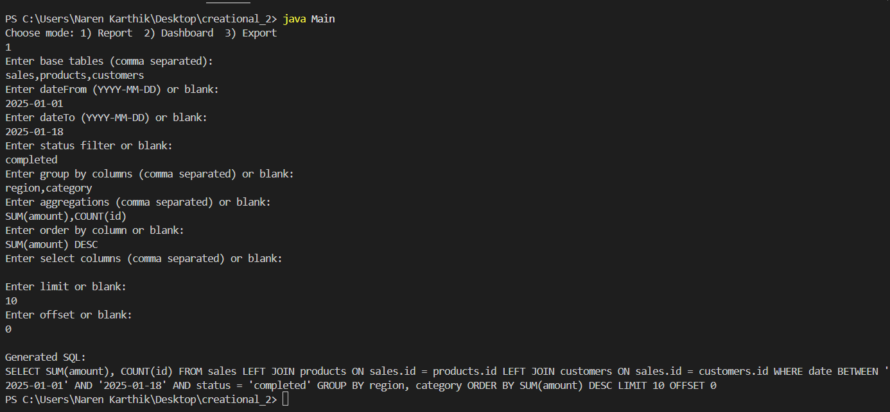
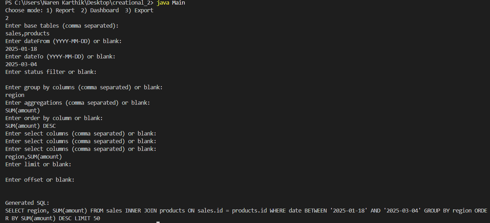

# Complex Database Query Constructor (Builder Pattern)

## Project Overview
This is a **console-based Java application** demonstrating the **Builder Design Pattern**. It allows an analytics platform to dynamically construct **SQL queries** based on user requirements.  

The same data can be queried differently for:
- **Reports** → complex analytical queries with joins and aggregations  
- **Dashboards** → optimized real-time queries  
- **Exports** → large dataset queries with pagination  

This project illustrates **dynamic SQL construction**, **performance optimization**, and **flexible query generation** for modern analytics platforms.

---

## Features
- Build SQL queries dynamically based on **user input**.
- Supports **Reports**, **Dashboards**, and **Exports**.
- Handles **JOINs**, **filters**, **GROUP BY**, **aggregations**, **sorting**, and **pagination**.
- Fully **console-based** for easy testing.

---

## How to Run

1. Open the **Integrated Terminal** in your editor (or command prompt) and navigate to the project folder:
    - cd path\to\Exercise1-Use_Cases\Creational_Pattern\Complex_Database_Query
2. Compile all Java files:
    - javac *.java
3. Run the application:
    - java Main

---

 ## Console Screenshots

