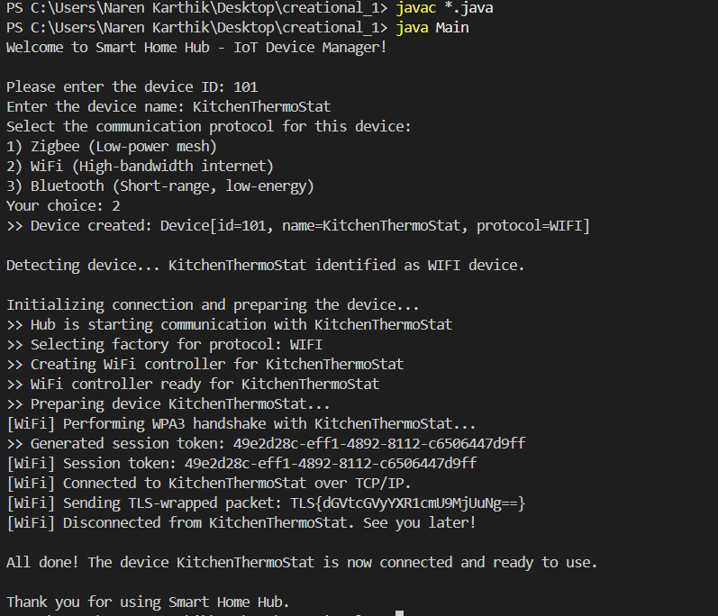

# IoT Device Communication - Factory Method Pattern

## Project Overview
This project demonstrates the **Factory Method Design Pattern** in a **console-based Java application** simulating a **Smart Home Hub** that communicates with different IoT devices over multiple protocols (Zigbee, WiFi, Bluetooth).  

The **hub detects devices**, selects the correct **protocol factory**, and **handles pairing, connection, data transmission, and disconnection** seamlessly.  

This design allows **adding new communication protocols** (e.g., Matter, Thread) without modifying existing hub logic.

---

## Features
- **Supports multiple protocols:** Zigbee, WiFi, Bluetooth  
- **Protocol-specific controllers:** Each controller handles pairing, encryption, and communication  
- **Humanized command-line outputs:** Explains each action in real-time  
- **Factory Method pattern:** Encapsulates creation of protocol-specific controllers  
- **Security simulation:** AES-128 encryption, TLS wrapping, BLE link keys  

---

---

## How It Works
1. **Device Creation:** User inputs device ID, name, and selects a communication protocol  
2. **Hub Detection:** Hub identifies the protocol and selects the appropriate factory  
3. **Controller Creation:** Factory creates protocol-specific controller  
4. **Pairing & Connection:** Controller handles pairing, encryption, and connection  
5. **Data Transmission:** Sends simulated data with protocol-specific encoding  
6. **Disconnection:** Controller disconnects device with humanized message  

---

## How to Run

1. Open the **Integrated Terminal** in your editor (or command prompt) and navigate to the project folder:
    - cd path\to\Exercise1-Use_Cases\Creational_Pattern\IoT_Device_Communication
2. Compile all Java files:
    - javac *.java
3. Run the application:
    - java Main

---

## Console Screenshots

