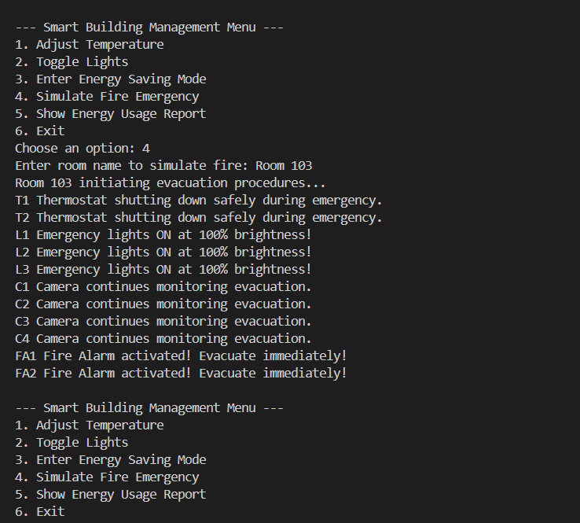

# Composite Pattern - Smart Building Management System

## Overview
This project demonstrates a **Composite Design Pattern** implementation for a **modular smart building management system**. It manages hierarchical structures (devices → rooms → floors → wings → buildings → campus) with uniform operations:

- Temperature adjustment
- Lighting control
- Energy usage aggregation
- Emergency evacuation

---

## Features
1. **Energy Saving Mode** – Cascades temperature and lighting settings down the hierarchy.
2. **Emergency Evacuation** – Activates alarms, emergency lights, and ensures safety.
3. **Energy Reporting** – Aggregates energy consumption from all devices.

---

## How to Run

1. Open the **Integrated Terminal** in your editor (or command prompt) and navigate to the project folder:
    - cd path\to\Exercise1-Use_Cases\Structural_Pattern\Interactive_Building_Manager
2. Compile all Java files:
    - javac *.java
3. Run the application:
    - java Main

---

## Console Screenshots

