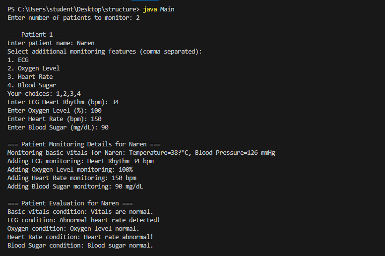
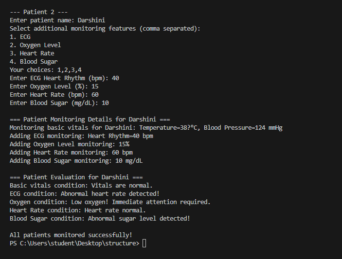

# Patient Monitoring System using Decorator Pattern

## Overview

This is a **console-based Java application** demonstrating the **Structural Decorator Design Pattern**.  
It simulates a **hospital patient monitoring system**, allowing dynamic addition of monitoring features such as:

- ECG (Heart Rhythm)
- Oxygen Level
- Heart Rate
- Blood Sugar

The system **evaluates patient conditions** based on the entered readings and supports **multiple patients** in a single run.

---

## Features

1. **Dynamic Feature Addition**  
   Using the Decorator Pattern, the system allows adding new monitoring features **without modifying existing code**.

2. **Multiple Patients Support**  
   Monitor and evaluate any number of patients sequentially in one session.

3. **User-Driven Input**  
   Instead of random values, the user inputs actual readings for each feature.

4. **Patient Condition Evaluation**  
   Provides simple evaluation messages based on standard health ranges.

5. **Extensible**  
   Easily extendable to include more monitoring features (e.g., Temperature, Respiration Rate).

---

## Modules / Classes

| Class Name              | Description |
|--------------------------|-------------|
| `PatientMonitor`         | Component interface defining monitoring and evaluation methods. |
| `BasicVitals`            | Concrete component: Monitors basic vitals like Temperature and Blood Pressure. |
| `MonitorDecorator`       | Abstract decorator class that wraps a `PatientMonitor`. |
| `ECGDecorator`           | Concrete decorator for ECG Heart Rhythm monitoring. |
| `OxygenDecorator`        | Concrete decorator for Oxygen Level monitoring. |
| `HeartRateDecorator`     | Concrete decorator for Heart Rate monitoring. |
| `BloodSugarDecorator`    | Concrete decorator for Blood Sugar monitoring. |
| `Main`                   | Main class: Handles user input, creates decorators, and displays results. |

---

## How to Run

1. Open the **Integrated Terminal** in your editor (or command prompt) and navigate to the project folder:
    - cd path\to\Exercise1-Use_Cases\Structural_Pattern\Patient_Monitoring_System
2. Compile all Java files:
    - javac *.java
3. Run the application:
    - java Main

