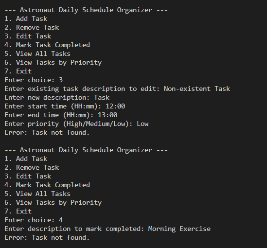

# Astronaut Daily Schedule Organizer

## Project Overview
The **Astronaut Daily Schedule Organizer** is a console-based application designed to help astronauts manage their daily tasks efficiently. Astronauts have highly structured days involving scientific experiments, mission briefings, spacewalk preparations, and exercise routines. This application allows users to **add, remove, edit, and view tasks**, as well as **mark tasks as completed** and **filter tasks by priority**.

It also includes **conflict detection** to notify users if newly added tasks overlap with existing tasks, ensuring optimal time management for critical operations.

---

## Features

### Mandatory Features
- Add a new task with description, start time, end time, and priority.
- Remove an existing task.
- View all tasks sorted by start time.
- Validate that new tasks do not overlap with existing tasks.
- Provide appropriate error messages for invalid operations.

### Optional Features
- Edit an existing task.
- Mark tasks as completed.
- View tasks filtered by priority (High/Medium/Low).

### Design Patterns Implemented
- **Singleton Pattern**: Ensures there is only one instance of `TaskManager` managing all tasks.
- **Factory Pattern**: `TaskFactory` is used to create new task objects.
- **Observer Pattern**: Notifies the user if a new task conflicts with existing tasks.

### Non-Functional Requirements
- Graceful exception handling for invalid inputs and errors.
- Logging of task operations and errors.
- Optimized performance for managing multiple tasks efficiently.

---

## How to Run

1. Open the **Integrated Terminal** in your editor (or command prompt) and navigate to the project folder:
    - cd path/to/Exercise2-Astronaut_Daily_Schedule_Organizer
2. Compile all Java files:
    - javac *.java
3. Run the application:
    - java Main

## Console Screenshots

